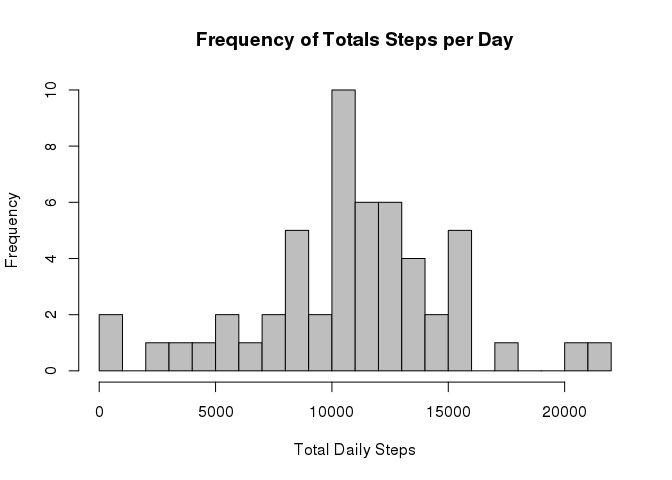
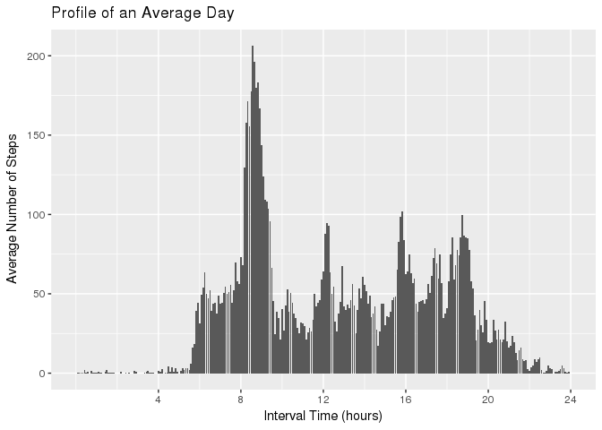
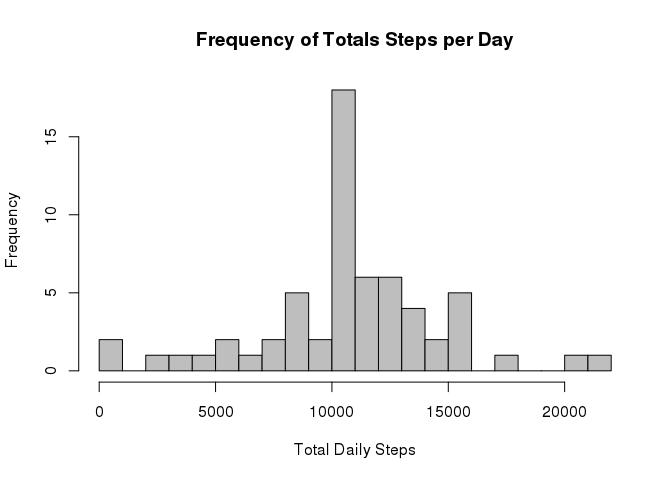
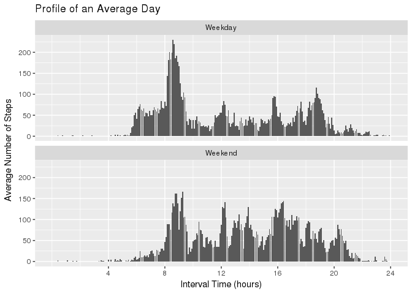

# Reproducible Research: Peer Assessment 1


## Loading and preprocessing the data

The data is delivered in a zipped format activity.zip that contains only one file, activity.csv. 
The activity data is unzipped and pulled right into a variable named "act"


```r
act<-read.csv(unz("activity.zip","activity.csv"))
```

## What is mean total number of steps taken per day?

Some of the days have no data supplied. For the time being, we will skip over those and remove them
from consideration. Thus to find the mean total number of steps taken per day, we will aggregate the 
total steps for each day, then take the mean of the resulting list, excluding NA values. 


```r
daily_step<-aggregate(act$steps,list(act$date),sum)
mean_steps<-mean(daily_step$x,na.rm=TRUE)
median_steps<-median(daily_step$x,na.rm=TRUE)
na_days<-sum(is.na(daily_step$x))
```

The mean total number of steps taken per day (not counting the 8 NA days) is 10766.19.

The median total number of steps taken per day is 10765

###Below is a histogram showing the distribution of the daily steps totals. 


```r
hist(daily_step[!is.na(daily_step$x),2],breaks=20,xlab="Total Daily Steps",
     main="Frequency of Totals Steps per Day",col="Gray")
```

<!-- -->

## What is the average daily activity pattern?

To visualize the average daily activity pattern, we will take the average of the steps in each
interval and then plot a barchart showing the averages for each interval. 


```r
library(ggplot2)
library(lubridate)
```

```
## 
## Attaching package: 'lubridate'
```

```
## The following object is masked from 'package:base':
## 
##     date
```

```r
library(stringr)
intvl_steps<-aggregate(act$steps,list(act$interval),mean,na.rm=TRUE)
# Convert the data to a time period for graphing more clearly
intvl_steps$date<-hm(paste(substr(str_pad(intvl_steps$Group.1,4,pad="0"),1,2)," ",substr(str_pad(intvl_steps$Group.1,4,pad="0"),3,4)))
# convert the time interval to seconds and divide by 3600 to get hours
g<-ggplot(intvl_steps,aes(period_to_seconds(intvl_steps$date)/3600,intvl_steps$x))+geom_col()
g<-g+scale_x_continuous(limits=c(0,24),breaks=c(4,8,12,16,20,24))
g<-g+xlab("Interval Time (hours)")+ylab("Average Number of Steps")+ggtitle("Profile of an Average Day")
# find the interval time with the highest average
highest_int<-intvl_steps[which.max(intvl_steps$x),"Group.1"]
# Produce the plot
print(g)
```

<!-- -->

The interval of time with the highest average number of steps is 835

## Imputing missing values


```r
m<-mean(is.na(daily_step$x))
s<-sum(is.na(daily_step$x))
```

It would appear that the missing data is typically an entire day at a time. The current data
contains 13.11 percent missing data. There are 8 days with NA values.

We will replace the missing values with the daily means calculated previously for each interval. 


```r
# copy the activity data to a second data frame
library(dplyr)
```

```
## 
## Attaching package: 'dplyr'
```

```
## The following objects are masked from 'package:lubridate':
## 
##     intersect, setdiff, union
```

```
## The following objects are masked from 'package:stats':
## 
##     filter, lag
```

```
## The following objects are masked from 'package:base':
## 
##     intersect, setdiff, setequal, union
```

```r
library(tidyr)
# Copy the intvl_steps and round to nearest integer value
intvl_steps2<-intvl_steps
intvl_steps2$x<-round(intvl_steps2$x)
# Use left_join to fill a column with the daily interval means then copy that into the missing fields
act2<- act %>%
   left_join(intvl_steps2, by = c("interval"="Group.1"))
act2$steps[is.na(act2$steps)]<-act2$x[is.na(act2$steps)]
act2<-act2 %>% select(steps:interval)
```


```r
daily_step2<-aggregate(act2$steps,list(act$date),sum)
mean_steps2<-mean(daily_step2$x,na.rm=TRUE)
median_steps2<-median(daily_step2$x,na.rm=TRUE)
na_days2<-sum(is.na(daily_step2$x))
```

The mean total number of steps taken per day (not counting the 0 NA days) is 10765.64.

The median total number of steps taken per day is 10762

The change in mean is -0.549335

The change in median is -3


###Below is a histogram showing the distribution of the daily steps totals. 


```r
hist(daily_step2[!is.na(daily_step2$x),2],breaks=20,xlab="Total Daily Steps",
     main="Frequency of Totals Steps per Day",col="Gray")
```

<!-- -->


## Are there differences in activity patterns between weekdays and weekends?

To analyze the differences in activity patterns, we have to create a new variable to 
seperate the weekdays and weekends. 


```r
w<-weekdays(ymd(act2$date.x),abbreviate=TRUE)
act2$w <- ifelse(w=="Sat"|w=="Sun","Weekend","Weekday")
intvl_steps2<-aggregate(act2$steps,list(act2$interval,act2$w),mean)
intvl_steps2$date<-hm(paste(substr(str_pad(intvl_steps2$Group.1,4,pad="0"),1,2)," ",substr(str_pad(intvl_steps2$Group.1,4,pad="0"),3,4)))
g<-ggplot(intvl_steps2,aes(period_to_seconds(intvl_steps2$date)/3600,intvl_steps2$x))+geom_col()
g<-g+scale_x_continuous(limits=c(0,24),breaks=c(4,8,12,16,20,24))
g<-g+xlab("Interval Time (hours)")+ylab("Average Number of Steps")+ggtitle("Profile of an Average Day")
g<-g+facet_wrap(~Group.2,ncol=1,nrow=2)
print(g)
```

<!-- -->
